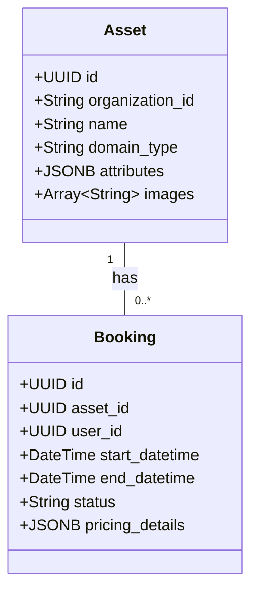
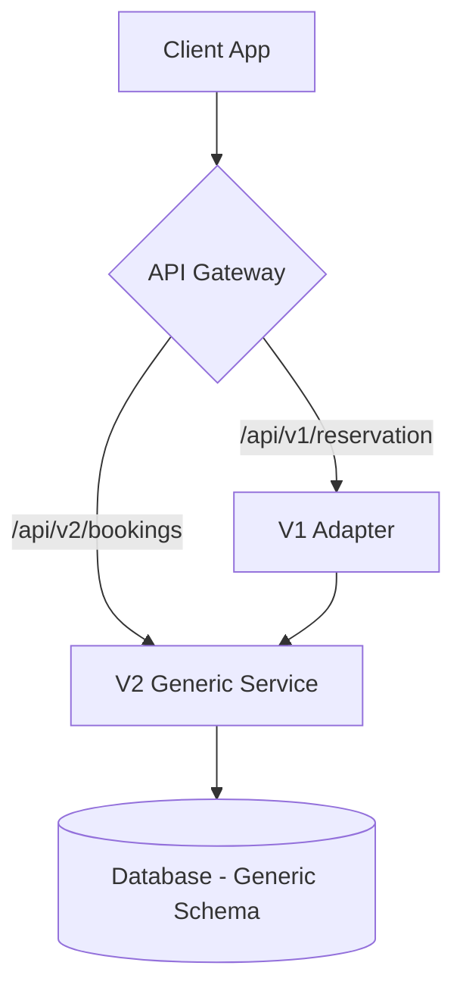

# 🌍 Ownima Pro: Asset-Teleport Working Plan

**Objective:** Pivot from Vehicle Rental to Multi-Domain Asset Management
**Version:** 1.0.0

---

## 1. Executive Summary
The objective of this pivot is to evolve the Ownima Pro platform from a single-domain vehicle rental application into a versatile, multi-domain asset management solution. By abstracting the core business logic from 'vehicles' to generic 'assets,' we can target new verticals such as property, equipment, and co-working space rentals. This expansion will significantly increase our Total Addressable Market (TAM) and create new revenue streams, with a target of increasing ARR by 40% within 18 months.

**Key Risks:**
*   Data migration complexities.
*   Challenge of maintaining seamless UX across domains.
*   AI model generalization.

**Success Metrics:**
*   MAU growth: 25% YoY.
*   Customer retention: >85%.
*   Time-to-onboard new domain: <2 weeks.
*   Data-mapping completeness: >95%.

---

## 2. Roadmap Phases

### 🚩 MVP: Domain Abstraction & First Vertical (3 Months)
**Goal:** Abstract the core domain model. Launch Property Rental. Validate architecture.

*   **KPIs:**
    *   Migrate 100% existing vehicle data.
    *   Onboard 10 beta property customers.
    *   CSAT > 4.5.
*   **AI Features:**
    *   **AI-Assisted Asset Onboarding (Must-have):** User pastes text (e.g., email), AI parses to structured asset.
    *   **Domain-Specific Intent Recognition (Must-have):** Chat understands "schedule viewing" vs "book test drive".
*   **Technical Tasks:**
    *   Refactor `LeaseData` → `Booking` and `Asset`.
    *   New `/api/v2/bookings` endpoint.
    *   UI Component library for dynamic schemas.

### 🚀 Phase 1: Expansion & AI Enhancement (6 Months)
**Goal:** Launch Equipment & Coworking verticals. Cross-domain AI.

*   **KPIs:** 20+ customers in new verticals. 50% increase in AI data entry.
*   **AI Features:**
    *   **Cross-Domain Recommendation (Should-have):** Suggest "Projector" when booking "Conference Room".
    *   **Dynamic Contract Generation (Could-have):** AI-generated clauses per domain/jurisdiction.
*   **Technical Tasks:**
    *   Recommendation engine.
    *   Legal API integration.
    *   Multi-domain dashboard.

---

## 3. Integration Strategy

### Domain Model Strategy
*   **Entities:** `Assets` (with `domain_type` and `attributes` JSONB) and `Bookings`.
*   **Migration:** Backfill script to transform `LeaseData` -> `Assets` + `Bookings`.
*   **Multi-tenancy:** Scoped by `organization_id`.

### API Compatibility
*   **V2:** `/api/v2` for generic models.
*   **V1:** `/api/v1` deprecated but maintained via adapter for 6 months.

### UI/UX Merge
*   **Dynamic Rendering:** `AssetViewer` renders based on `domain_type`.
*   **Toggles:** Feature flags for staged rollout.

---

## 4. Data Mapping (Vehicle -> Generic)

| Vehicle Field | Generic Field | Type | Conversion Rule | Example (Property) |
| :--- | :--- | :--- | :--- | :--- |
| `vehicle.name` | `asset.name` | String | Direct copy | 'Sunny 2BR Apartment' |
| `vehicle.plate` | `asset.unique_identifier` | String | Direct copy | 'Unit 501' |
| `vehicle.imageUrl` | `asset.images` | Array | Wrap in array | `['kitchen.jpg']` |
| `pickup` | `booking.start_datetime` | DateTime | Combine date+time | '2024-12-20T14:00:00Z' |
| `dropoff` | `booking.end_datetime` | DateTime | Combine date+time | '2025-01-20T11:00:00Z' |
| `pricing.total` | `booking.pricing.total_amount` | Number | Direct copy | 1200.00 |
| `terms` | `booking.contract_terms` | String | Direct copy | 'Standard lease...' |

---

## 5. Technical Architecture

### Database Schema

### API Strategy

---

## 6. AI & UX Workflows

### AI Asset Creation
1.  **Prompt:** User pastes text description.
2.  **Analysis:** Gemini parses attributes (Address, Bedrooms, Amenities).
3.  **Review:** UI displays parsed fields for confirmation.
4.  **Save:** Asset created in DB.

### Multi-Domain Scheduler
*   **Filter:** Dropdown for 'Asset Domain'.
*   **Visuals:** Color-coded blocks (Blue=Vehicle, Green=Property).

---

## 7. Engineering Checklist
*   [ ] Data migration script ready.
*   [ ] API V2 versioning strategy active.
*   [ ] UI components tested with Vehicle, Property, Equipment schemas.
*   [ ] CI/CD pipeline covers all domains.
*   [ ] Security: PII encryption and audit trails.

## 8. Playbooks
*   **AI Misclassification:** Triage -> Escalate -> Disable Feature Flag -> Retrain.
*   **Data Drift:** Detect new keywords -> Update Schema -> Update Prompt -> Backfill.
